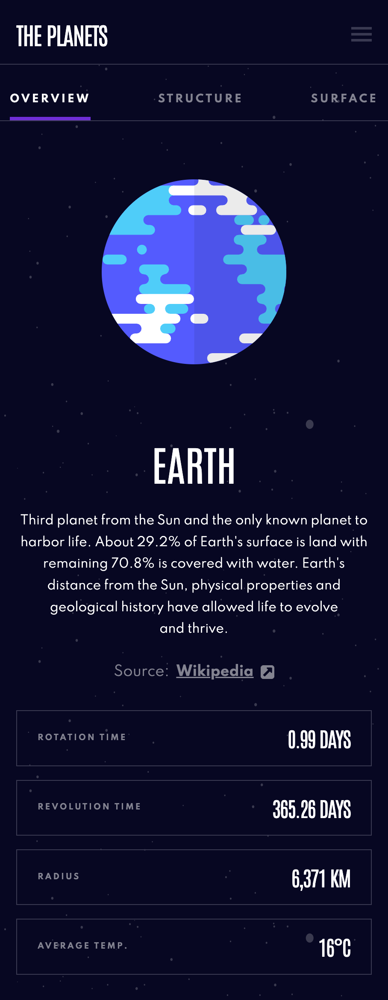

# Frontend Mentor - Planets fact site solution

This is a solution to the [Planets fact site challenge on Frontend Mentor](https://www.frontendmentor.io/challenges/planets-fact-site-gazqN8w_f). Frontend Mentor challenges help you improve your coding skills by building realistic projects.

## Table of contents

- [Overview](#overview)
   - [The challenge](#the-challenge)
   - [Screenshot](#screenshot)
   - [Links](#links)
- [My process](#my-process)
   - [Built with](#built-with)
   - [What I learned](#what-i-learned)
   - [Continued development](#continued-development)
- [Author](#author)

## Overview

### The challenge

Users should be able to:

- View the optimal layout for the app depending on their device's screen size
- See hover states for all interactive elements on the page
- View each planet page and toggle between "Overview", "Internal Structure", and "Surface Geology"

### Screenshot



### Links

- Solution URL: (https://github.com/nextechnician/planets-fact-site)
- Live Site URL: [Add live site URL here](https://your-live-site-url.com)

## My process

This project was built using a state-driven approach without routing. All UI changes are controlled by React state and reflected through semantic markup and CSS variables. Layout and design tokens were defined first, followed by component structure and finally interactivity. Planet-specific visuals are driven declaratively using `data-*` attributes, allowing complex styling and scaling without JavaScript-driven layout logic.

### Built with

- Semantic HTML5 markup
- CSS custom properties
- Flexbox
- CSS Grid
- Mobile-first workflow
- [React](https://reactjs.org/) - JS library
- [TypeScript]

### What I learned

This project helped me understand how to build a purely state-driven UI in React without routing, effects, or DOM mutation. The entire interface is driven by React state and reflected through data attributes, with CSS handling all visual logic.

I learned how to:

- Build a fully state-driven UI without React Router or `useEffect`
- Use `data-*` attributes and CSS custom properties to link application state to styling
- Create a fixed visual stage with scalable content to prevent layout shifts
- Centralise responsive behaviour and visual variance using design tokens
- Separate structure, data, and styling for maintainable React layouts

This approach allowed me to scale and theme complex visuals declaratively, without introducing JavaScript-driven styling logic.

```css
--clr-planet-mercury: var(--sky-400);
--clr-planet-venus: var(--amber-400);
--clr-planet-earth: var(--purple-600);
--clr-planet-mars: var(--orange-600);
--clr-planet-jupiter: var(--red-500);
--clr-planet-saturn: var(--bronze-700);
--clr-planet-uranus: var(--teal-400);
--clr-planet-neptune: var(--blue-600);

--clr-planet-current: var(--clr-planet-earth);
--clr-border-interactive: var(--clr-planet-current);
--clr-interactive-active: var(--clr-planet-current);

[data-planet='Mercury'] {
   --clr-planet-current: var(--clr-planet-mercury);
}
[data-planet='Venus'] {
   --clr-planet-current: var(--clr-planet-venus);
}
[data-planet='Earth'] {
   --clr-planet-current: var(--clr-planet-earth);
}
[data-planet='Mars'] {
   --clr-planet-current: var(--clr-planet-mars);
}

/* Base visual rules */
--planet-base-size: 11.25rem;
--planet-stage-size: 14rem;
--geo-x: 50.5%;
--geo-y: 79%;

/* Planet-specific scaling */
[data-planet='Mercury'] {
   --planet-scale: 0.8;
   --geo-x: 50.2%;
   --geo-y: 78%;
}

[data-planet='Venus'] {
   --planet-scale: 1.1;
   --geo-x: 50.2%;
   --geo-y: 78%;
}
```

### Continued development

In future projects, I want to lock down the JSX layout structure earlier. I found that changing component structure mid-build caused avoidable rework, even when the logic was correct. Spending more time upfront on layout will help keep styling and interactivity simpler and more predictable.

## Author

- Frontend Mentor - [@nextechnician](https://www.frontendmentor.io/profile/nextechnician)
